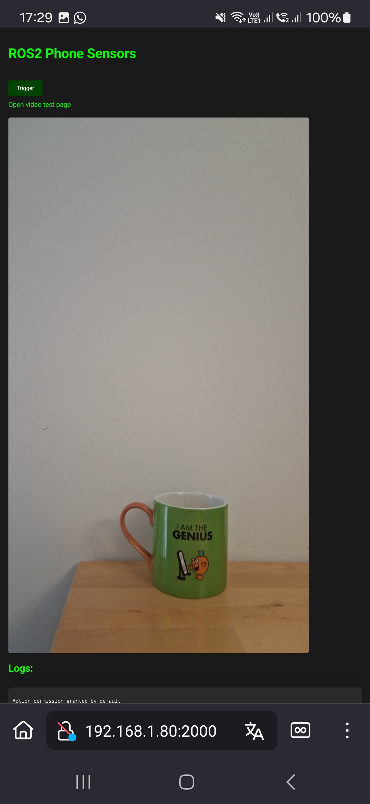
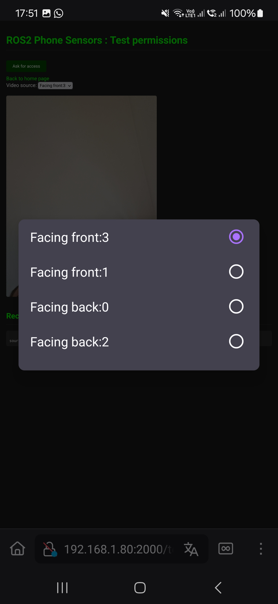
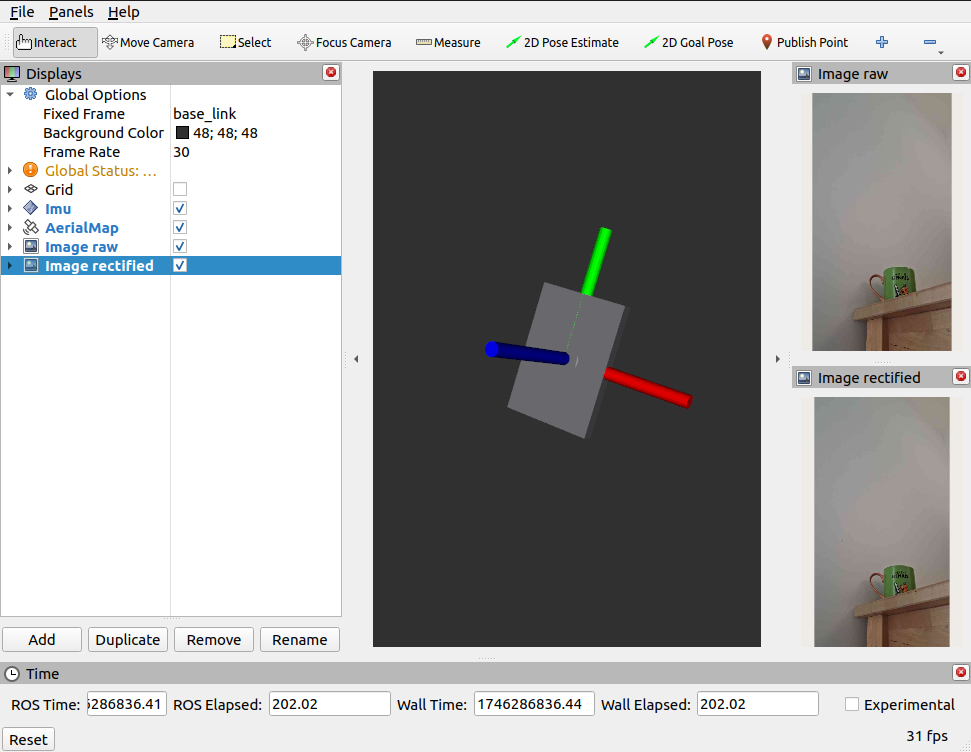

# Use your phone as a sensor in ROS2

While many projects exist to control your robot from your phone, this project is the other way around; your phone is the robot' sensors ! It will send the camera feed, IMU and GPS so that you may integrate the phone onto a mobile base.

The particularity of this project is that it relies on the mobile browser instead of a specific app. A webpage is served from the ROS2 node, opening the page from a mobile client will ask for permissions in the browser. The data is transmitted between the server and client using websockets for a modern and fast communication, as opposed to making HTTP requests or streaming UDP.

This repository is inspired by a project I did with students as a TA called [phone-imu](https://github.com/vtalpaert/phone-imu).

## Build

```bash
source /opt/ros/humble/setup.bash
rosdep install -i --from-path src --rosdistro humble -y --ignore-src
colcon build --packages-up-to phone_sensors
# Or build for development
# colcon build --symlink-install  --packages-up-to phone_sensors_examples --event-handlers console_direct+
```

## `phone_sensors` usage

### Quickstart

Do not run in the same terminal you built in, otherwise you might run from the `build` folder which will not contain the template folder for the webpage.

```bash
source install/setup.bash

# Ubuntu IP
EXTRA_IP=$(ip route get 8.8.8.8 | grep -oP 'src \K[^ ]+')
echo "My IP is $EXTRA_IP"
# Generate SSL certificates for local webserver 
ros2 run phone_sensors generate_dev_certificates.sh $EXTRA_IP

# Start server
ros2 run phone_sensors server --ros-args -p video_width:=1280 -p video_height:=720
```

Open the webpage from your mobile device. The URL depends on your network, but most likely is `https://<EXTRA_IP>:2000`.
If you have multiple network interfaces, favour the fastest such as ethernet over wifi.

The page will prompt for permissions, then display the chosen camera
<p align="center">
    
</p>

### Parameters

| Name                           | Type   | Default          | Unit   | Description                                                  |
| ------------------------------ | ------ | ---------------- | ------ | ------------------------------------------------------------ |
| `host`                         | string | "0.0.0.0"        | IP     | Use `0.0.0.0` to accept connections outside of localhost     |
| `port`                         | int    | 2000             |        | The port where the server listens on                         |
| `debug`                        | bool   | True             |        | Use Flask in debug mode                                      |
| `secret_key`                   | string | "secret!"        |        | Flask SECRET_KEY                                             |
| `ssl_certificate`              | string | "certs/certificate.crt" | path | Path to public SSL certificate                          |
| `ssl_private_key`              | string | "certs/private.key" | path | Path to private SSL key                                     |
| `use_ros_time`                 | bool   | False            |        | Use ROS time instead of device time for message timestamps   |
| `time_reference_source_device` | string | "ros_to_device"  |        | Source identifier for device TimeReference messages          |
| `time_reference_source_gnss`   | string | "device_to_gnss" |        | Source identifier for GNSS TimeReference messages            |
| `time_reference_frequency`     | float  | -1.0             | Hz     | Rate to emit TimeReference data                              |
| `imu_frequency`                | float  | 100.0            | Hz     | Rate to emit IMU data                                        |
| `gnss_frequency`               | float  | 10.0             | Hz     | Rate to emit GNSS data                                       |
| `frame_id_imu`                 | string | package_name     |        | Frame ID for IMU messages                                    |
| `frame_id_gnss`                | string | package_name     |        | Frame ID for GNSS messages                                   |
| `frame_id_image`               | string | package_name     |        | Frame ID for camera image messages                           |
| `camera_device_label`          | string | "Facing front:1" |        | Label to identify which camera to use                        |
| `show_video_preview`           | bool   | True             |        | Show video preview on client device                          |
| `video_fps`                    | float  | 30.0             | Hz     | Video frame rate                                             |
| `video_width`                  | int    | 1280             | pixels | Video frame width                                            |
| `video_height`                 | int    | 720              | pixels | Video frame height                                           |
| `video_compression`            | float  | 0.3              | 0-1    | JPEG compression quality (0=max compression, 1=best quality) |
| `camera_calibration_file`      | string | ""               | path   | Path to camera calibration YAML file (output from camera_calibration) |

A negative value for the time reference, IMU or GNSS frequencies will disable sending the corresponding data from the client device. This allows conserving bandwidth and processing power when certain sensors are not needed.

To find out the available `camera_device_label`, open the video test page
<p align="center">
    
</p>

## `phone_sensors_examples`

### Camera calibration & RVIZ

To calibrate you camera, print the [checkerboard](src/phone_sensors_examples/config/calib.io_checker_297x210_8x11_20.pdf) in maximum page size. While printing, do not adjust the size.

```bash
# Calibrate camera using GUI
source install/setup.bash
ros2 launch phone_sensors_examples calibrate.launch.py

# Generate SSL certificates for local webserver 
#ros2 run phone_sensors generate_dev_certificates.sh $(ip route get 8.8.8.8 | grep -oP 'src \K[^ ]+')

# Extract the calibration so that launch files will know where to look
tar -xvf /tmp/calibrationdata.tar.gz --exclude=*.png --directory src/phone_sensors_examples/config/
# Server, image rectification, RVIZ
ros2 launch phone_sensors_examples rviz.launch.py

# Start only the node
#ros2 run phone_sensors server --ros-args -p camera_calibration_file:=src/phone_sensors_examples/config/ost.yaml
```



## TODO

- [x] Explain usage with images and how the browser side behaves (in particular permissions)
- [ ] Test with different browsers (I am looking for testers though !)
- [ ] Document server files
- [x] Publish [TimeReference](https://docs.ros2.org/foxy/api/sensor_msgs/msg/TimeReference.html)
- [x] Publish [IMU](https://docs.ros2.org/foxy/api/sensor_msgs/msg/Imu.html)
- [x] Publish [GPS (NavSatFix)](https://docs.ros2.org/foxy/api/sensor_msgs/msg/NavSatFix.html)
- [ ] If GeoLocation provides speed and heading, publish an Odometry message
- [x] Calibrate camera in examples package
- [x] Publish [CameraInfo](https://docs.ros2.org/foxy/api/sensor_msgs/msg/CameraInfo.html)
- [x] Publish [video stream (Image)](https://docs.ros2.org/foxy/api/sensor_msgs/msg/Image.html)
- [ ] Publish orientation as a [Quaternion](http://docs.ros.org/en/api/geometry_msgs/html/msg/Quaternion.html) or [Odometry](http://docs.ros.org/en/api/nav_msgs/html/msg/Odometry.html)
- [ ] Add [Serial](https://developer.mozilla.org/en-US/docs/Web/API/Web_Serial_API) or Bluetooth, as a possible way for the phone to send data over USB to a microcontroller
- [x] Launch file example to set parameters
- [ ] robot_localization example with control feedback in place of speed odometry
- [ ] robot_localization example with visual inertial odometry
- [ ] Fix issue where the video is not sent when `show_video_preview` is `False`
- [ ] Add tests for `message_converters.py`
- [ ] Use `/camera/image/compressed/jpeg_quality` output topic according to [image_transport](https://wiki.ros.org/image_transport)
- [ ] Use SocketIO namespaces to separate video and other data
