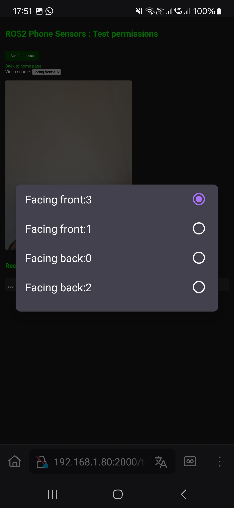

# Use your phone as a sensor in ROS2

While many projects exist to control your robot from your phone, this project is the other way around; your phone is the robot' sensors ! It will send the camera feed, IMU and GPS so that you may integrate the phone onto a mobile base.

The particularity of this project is that it relies on the mobile browser instead of a specific app. A webpage is served from the ROS2 node, opening the page from a mobile client will ask for permissions in the browser. The data is transmitted between the server and client using websockets for a modern and fast communication, as opposed to making HTTP requests or streaming UDP.

This repository is inspired by a project I did with students as a TA called [phone-imu](https://github.com/vtalpaert/phone-imu).

## Build

```bash
source /opt/ros/humble/setup.bash
rosdep install -i --from-path src --rosdistro humble -y --ignore-src
colcon build --packages-up-to phone_sensors_bridge
# Or build for development, but remember to clean and rebuild every time the JS files are changed
# colcon build --symlink-install  --packages-up-to phone_sensors_bridge_examples --event-handlers console_direct+
```

## `phone_sensors_bridge` usage

### Quickstart

Run the following in a different terminal than the one used for building, otherwise the server might start from inside the `build` folder which will not contain the template and static folders for the webpage.

```bash
source install/setup.bash

# Ubuntu IP
EXTRA_IP=$(ip route get 8.8.8.8 | grep -oP 'src \K[^ ]+')
echo "My IP is $EXTRA_IP"
# Generate SSL certificates for local webserver 
ros2 run phone_sensors_bridge generate_dev_certificates.sh $EXTRA_IP

# Start server
ros2 run phone_sensors_bridge server --ros-args -p video_width:=1280 -p video_height:=720
```

Open the webpage from your mobile device. The URL contains the server host IP where the node is running. It depends on your network, but most likely is `https://<EXTRA_IP>:2000`.
If you have multiple network interfaces, favour the fastest such as ethernet over wifi.

The page will prompt for permissions, then display the chosen camera
<p align="center">
    
</p>

### Published topics

| Topic | Type | Description |
| ----- | ---- | ----------- |
| `time/device` | `sensor_msgs/TimeReference` | Device system clock versus ROS time |
| `time/gnss` | `sensor_msgs/TimeReference` | GNSS fix acquisition time versus device clock |
| `imu` | `sensor_msgs/Imu` | Orientation (ENU quaternion), angular velocity and linear acceleration in the device frame |
| `gnss` | `sensor_msgs/NavSatFix` | GPS fix: latitude, longitude, altitude with horizontal/vertical accuracy covariance |
| `gnss/odometry` | `nav_msgs/Odometry` | GPS-derived velocity in the ENU frame; pose covariance is 1e9 (fuse twist only) |
| `camera1/image_raw` | `sensor_msgs/Image` | Camera 1 video stream |
| `camera2/image_raw` | `sensor_msgs/Image` | Camera 2 video stream |
| `camera1/camera_info` | `sensor_msgs/CameraInfo` | Camera 1 calibration (only published when `camera1_calibration_file` is set) |
| `camera2/camera_info` | `sensor_msgs/CameraInfo` | Camera 2 calibration (only published when `camera2_calibration_file` is set) |

### Parameters

| Name                           | Type   | Default          | Unit   | Description                                                  |
| ------------------------------ | ------ | ---------------- | ------ | ------------------------------------------------------------ |
| `host`                         | string | "0.0.0.0"        | IP     | Use `0.0.0.0` to accept connections outside of localhost     |
| `port`                         | int    | 2000             |        | The port where the server listens on                         |
| `debug`                        | bool   | True             |        | Use Flask in debug mode                                      |
| `secret_key`                   | string | "secret!"        |        | Flask SECRET_KEY                                             |
| `ssl_certificate`              | string | "certs/certificate.crt" | path | Path to public SSL certificate                          |
| `ssl_private_key`              | string | "certs/private.key" | path | Path to private SSL key                                     |
| `use_ros_time`                 | bool   | False            |        | Use ROS time instead of device time for message timestamps   |
| `time_reference_source_device` | string | "ros_to_device"  |        | Source identifier for device TimeReference messages          |
| `time_reference_source_gnss`   | string | "device_to_gnss" |        | Source identifier for GNSS TimeReference messages            |
| `time_reference_frequency`     | float  | -1.0             | Hz     | Rate to emit TimeReference data                              |
| `imu_frequency`                | float  | 50.0             | Hz     | Rate to emit IMU data                                        |
| `gnss_frequency`               | float  | 10.0             | Hz     | Rate to emit GNSS data (polling mode only)                   |
| `frame_id_imu`                 | string | package_name     |        | Frame ID for IMU messages                                    |
| `frame_id_gnss`                | string | package_name     |        | Frame ID for GNSS messages                                   |
| `frame_id_image_camera1`       | string | package_name_camera1 |    | Frame ID for camera1 image messages                          |
| `frame_id_image_camera2`       | string | package_name_camera2 |    | Frame ID for camera2 image messages                          |
| `camera1_device_label`         | string | "Facing front:3" |        | Label to identify which camera to use for camera1           |
| `camera1_video_fps`            | float  | 20.0             | Hz     | Video frame rate for camera1                                 |
| `camera1_video_width`          | int    | 720              | pixels | Video frame width for camera1                                |
| `camera1_video_height`         | int    | 720              | pixels | Video frame height for camera1                               |
| `camera1_video_compression`    | float  | 0.3              | 0-1    | JPEG compression quality for camera1 (0=max compression, 1=best quality) |
| `camera1_calibration_file`     | string | ""               | path   | Path to camera1 calibration YAML file (output from camera_calibration) |
| `camera2_device_label`         | string | "Facing back:0"  |        | Label to identify which camera to use for camera2           |
| `camera2_video_fps`            | float  | 20.0             | Hz     | Video frame rate for camera2                                 |
| `camera2_video_width`          | int    | 720              | pixels | Video frame width for camera2                                |
| `camera2_video_height`         | int    | 720              | pixels | Video frame height for camera2                               |
| `camera2_video_compression`    | float  | 0.3              | 0-1    | JPEG compression quality for camera2 (0=max compression, 1=best quality) |
| `camera2_calibration_file`     | string | ""               | path   | Path to camera2 calibration YAML file (output from camera_calibration) |

A negative value for the time reference, IMU, GNSS frequencies or video FPS will disable sending the corresponding data from the client device. This allows conserving bandwidth and processing power when certain sensors are not needed.

Note: `gnss_frequency` only takes effect when `useWatchPosition` is set to `false` in `geolocation.js`. When `watchPosition` is used (the current default), the browser controls the GPS update rate and this parameter is ignored.

To find out the available `camera1_device_label` and `camera2_device_label`, open the video test page
<p align="center">
    
</p>

### Coordinates

#### IMU frame (`frame_id_imu`)

The device rotation rate and linear acceleration are expressed in the **device coordinate frame**:
<p align="center">
    
</p>

The device orientation is defined in **ENU (East-North-Up)**. The angles alpha, beta, gamma from the web API are rotations around Z, X, Y respectively.
They are converted to a quaternion using beta as roll, gamma as pitch, alpha as yaw. The behaviour of a device with its Y-axis pointing up is unstable since the API is only defined between -90° to +90°. See the [web API documentation](https://developer.mozilla.org/en-US/docs/Web/API/Window/deviceorientationabsolute_event) for more details.

#### GNSS frame (`frame_id_gnss`)

The `gnss` (NavSatFix) and `gnss/odometry` messages share the same frame ID set by `frame_id_gnss`.

This frame is **ENU-aligned**: X points East, Y points North, Z points Up. The `gnss/odometry` message uses this frame for both `header.frame_id` and `child_frame_id`, meaning the twist is expressed in ENU coordinates:

- `twist.linear.x` — East velocity (m/s)
- `twist.linear.y` — North velocity (m/s)

The browser [GeolocationCoordinates](https://developer.mozilla.org/en-US/docs/Web/API/GeolocationCoordinates) API reports heading in degrees clockwise from true North (0 = North, 90 = East). This is converted to ENU velocity components as:

```
vx (East)  = speed × sin(heading_rad)
vy (North) = speed × cos(heading_rad)
```

The message is published according to the following cases:

| Condition | Twist | Twist covariance (vx, vy) |
| --------- | ----- | ------------------------- |
| `heading` available, `speed` > 0 | ENU velocity from heading + speed | 0.01 (m/s)² |
| `heading` is null, `speed` ≈ 0 | Zero (stationary) | 0.001 (m/s)² |
| `heading` is null, `speed` > 0 | Zero (direction unknown) | 1e9 (ignore) |
| `speed` is null | Not published | — |

The pose covariance is set to 1e9 on all diagonal elements. When using `robot_localization`, configure it to fuse the **twist** from `gnss/odometry` and the **position** from `gnss` (via `navsat_transform_node`), not the pose of the odometry message.

### Browser compatibility

The current server is tested with Firefox and Chrome.

GeoLocation:

- Issue in Firefox: getting the position silently fails

Video:

- Browsers do not use the same device labels

## `phone_sensors_bridge_examples`

### Camera calibration & RVIZ

To calibrate you camera, print the [checkerboard](src/phone_sensors_bridge_examples/config/calib.io_checker_297x210_8x11_20.pdf) in maximum page size. While printing, do not adjust the size.

```bash
# Calibrate camera using GUI
source install/setup.bash
ros2 launch phone_sensors_bridge_examples calibrate.launch.py

# Generate SSL certificates for local webserver 
#ros2 run phone_sensors_bridge generate_dev_certificates.sh $(ip route get 8.8.8.8 | grep -oP 'src \K[^ ]+')

# Extract the calibration so that launch files will know where to look
tar -xvf /tmp/calibrationdata.tar.gz --exclude=*.png --directory src/phone_sensors_bridge_examples/config/
# Server, image rectification, RVIZ
ros2 launch phone_sensors_bridge_examples rviz.launch.py

# Start only the node
#ros2 run phone_sensors_bridge server --ros-args -p camera_calibration_file:=src/phone_sensors_bridge_examples/config/ost.yaml
```


## TODO

- [x] Explain usage with images and how the browser side behaves (in particular permissions)
- [x] Test with different browsers (I am looking for testers though !)
- [ ] Document server files
- [x] Publish [TimeReference](https://docs.ros2.org/foxy/api/sensor_msgs/msg/TimeReference.html)
- [x] Publish [IMU](https://docs.ros2.org/foxy/api/sensor_msgs/msg/Imu.html)
- [x] Publish [GPS (NavSatFix)](https://docs.ros2.org/foxy/api/sensor_msgs/msg/NavSatFix.html)
- [x] If GeoLocation provides speed and heading, publish an Odometry message
- [x] Calibrate camera in examples package
- [x] Publish [CameraInfo](https://docs.ros2.org/foxy/api/sensor_msgs/msg/CameraInfo.html)
- [x] Publish [video stream (Image)](https://docs.ros2.org/foxy/api/sensor_msgs/msg/Image.html)
- [ ] Add [Serial](https://developer.mozilla.org/en-US/docs/Web/API/Web_Serial_API) or Bluetooth, as a possible way for the phone to send data over USB to a microcontroller
- [x] Launch file example to set parameters
- [ ] robot_localization example with control feedback in place of speed odometry
- [ ] robot_localization example with visual inertial odometry
- [x] Fix issue where the video is not sent when `show_video_preview` is `False`
- [x] Fix frequency issue
- [ ] Add tests for `message_converters.py`
- [ ] Use `/camera/image/compressed/jpeg_quality` output topic according to [image_transport](https://wiki.ros.org/image_transport)
- [ ] Use SocketIO namespaces to separate video and other data
