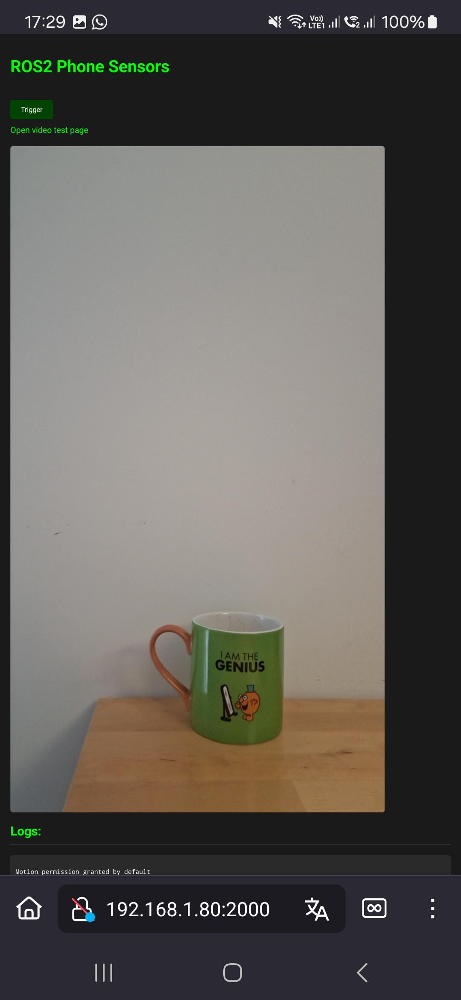
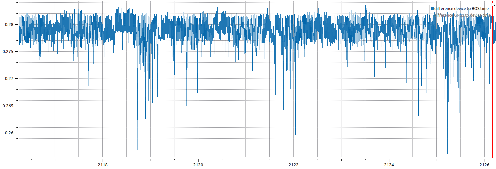
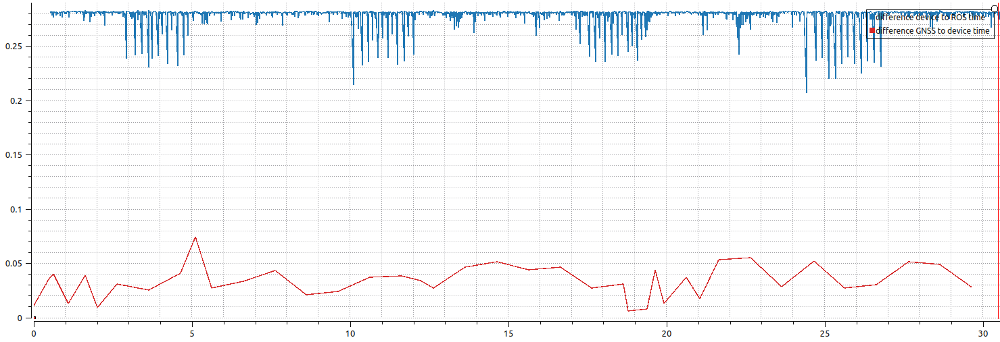
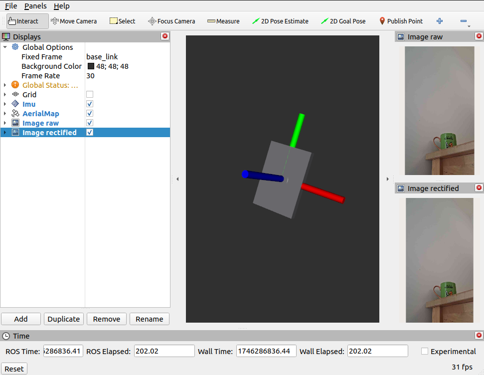

# Use your phone as a sensor in ROS2

While many projects exist to control your robot from your phone, this project is the other way around; your phone is the robot' sensors ! It will send the camera feed, IMU and GPS so that you may integrate the phone onto a mobile base.

The particularity of this project is that it relies on the mobile browser instead of a specific app. A webpage is served from the ROS2 node, opening the page from a mobile client will ask for permissions in the browser. The data is transmitted between the server and client using websockets for a modern and fast communication, as opposed to making HTTP requests or streaming UDP.

This repository is inspired by a project I did with students as a TA called [phone-imu](https://github.com/vtalpaert/phone-imu).

## Build

```bash
source /opt/ros/humble/setup.bash
rosdep install -i --from-path src --rosdistro humble -y --ignore-src
colcon build --packages-up-to phone_sensors_bridge
# Or build for development, but remember to clean and rebuild every time the JS files are changed
# colcon build --symlink-install  --packages-up-to phone_sensors_bridge_examples --event-handlers console_direct+
```

## `phone_sensors_bridge` usage

### Quickstart

Run the following in a different terminal than the one used for building, otherwise the server might start from inside the `build` folder which will not contain the template and static folders for the webpage.

```bash
source install/setup.bash

# Ubuntu IP
EXTRA_IP=$(ip route get 8.8.8.8 | grep -oP 'src \K[^ ]+')
echo "My IP is $EXTRA_IP"
# Generate SSL certificates for local webserver 
ros2 run phone_sensors_bridge generate_dev_certificates.sh $EXTRA_IP

# Start server
ros2 run phone_sensors_bridge server --ros-args -p camera1_video_width:=720 -p camera1_video_height:=720
```

Open the webpage from your mobile device. The URL contains the server host IP where the node is running. It depends on your network, but most likely is `https://<EXTRA_IP>:2000`.
If you have multiple network interfaces, favour the fastest such as ethernet over wifi.

The page will prompt for permissions, then display the chosen camera
<p align="center">
    
</p>

### Published topics

| Topic | Type | Description |
| ----- | ---- | ----------- |
| `time/device` | `sensor_msgs/TimeReference` | Device system clock versus ROS time |
| `time/gnss` | `sensor_msgs/TimeReference` | GNSS fix acquisition time versus device clock |
| `imu` | `sensor_msgs/Imu` | Orientation (ENU quaternion), angular velocity and linear acceleration in the device frame |
| `gnss` | `sensor_msgs/NavSatFix` | GPS fix: latitude, longitude, altitude with horizontal/vertical accuracy covariance |
| `gnss/odometry` | `nav_msgs/Odometry` | GPS-derived velocity in the ENU frame; pose covariance is 1e9 (fuse twist only) |
| `camera1/image_raw` | `sensor_msgs/Image` | Camera 1 video stream |
| `camera2/image_raw` | `sensor_msgs/Image` | Camera 2 video stream |
| `camera1/camera_info` | `sensor_msgs/CameraInfo` | Camera 1 calibration (only published when `camera1_calibration_file` is set) |
| `camera2/camera_info` | `sensor_msgs/CameraInfo` | Camera 2 calibration (only published when `camera2_calibration_file` is set) |
| `usb/rx` | `std_msgs/UInt8MultiArray` | Raw bytes received from the USB device (only active when `usb_enabled` is `True`) |

### Subscribed topics

| Topic | Type | Description |
| ----- | ---- | ----------- |
| `usb/tx` | `std_msgs/UInt8MultiArray` | Raw bytes to forward to the USB device (only active when `usb_enabled` is `True`) |

### Configuration

See the [server configuration guide](docs/configuration_guide_server.md)

### Results

The current server is tested with Firefox and Chrome on Android.

#### Latency

The webpage includes a "Measure latency" button that runs 100 sequential WebSocket ping-pong round trips and reports one-way latency and clock offset using the NTP formula:

```txt
RTT             = t2_client - t1_client
latency         = RTT / 2
clock_offset    = t_server - (t1_client + t2_client) / 2
```

Example measurement over a local WiFi network when running two video feeds, IMU and GNSS:

```txt
Latency (N=100): mean=5.19 ms, min=1.50 ms, max=12.50 ms | Clock offset (ROS-client): mean=-293.10 ms, min=-300.00 ms, max=-285.00 ms
```

A **negative clock offset** means the ROS clock is behind the client (phone) clock, in this case by ~293 ms. A **positive offset** would mean the ROS clock is ahead. This offset is stable across samples (spread of ~15 ms), which indicates a consistent skew rather than jitter. If the parameter `time_reference_frequency` is strictly positive, then the `time/device` TimeReference topic reports the clock difference including network latency.


We observe the same clock offset in PlotJuggler expressed in seconds, in this case measured running only `time_reference_frequency:=100.0` and no video. The offset here is the difference in clock time **plus network latency**

#### GeoLocation

- Works in both Firefox and Chrome via `watchPosition`. To obtain an `Odometry` message, you may need to move around your device.
- If your log show a GNSS starting error on Chrome, sometimes waiting 10s will fix it. Otherwise a page reload can help solve some cases.


The published `NavSatFix` and `Odometry` messages use the GNSS time, which may be 50 ms old when the browser on the client side obtains the data (red line). This directly depends on the quality of GNSS reception, this delay may be much higher indoor far away from a window. A `TimeReference` message on `/time/gnss` is always published to report this delay.

#### Video

- Camera device labels differ between Firefox and Chrome; the `test_video_permissions` page (linked from the home page) shows the correct `camera1_device_label` and `camera2_device_label` for your browser

#### USB devices

- The [Web Serial API](https://developer.mozilla.org/en-US/docs/Web/API/Web_Serial_API) is not supported in Firefox. On Android Chrome, version 145 seems to have WebSerial available but does not work for USB devices. It might work for Bluetooth devices, which may be added as a feature if any Issue requests it. Use the test pages to verify your state.
- For connecting USB serial devices (microcontrollers, sensors), the project uses WebUSB instead of Web Serial. See the [USB serial devices guide](docs/usb_serial_devices.md) for compatible hardware, supported chip protocols, and example code.

## `phone_sensors_bridge_examples`

### Camera calibration & RVIZ

To calibrate you camera, print the [checkerboard](src/phone_sensors_bridge_examples/config/calib.io_checker_297x210_8x11_20.pdf) in maximum page size. While printing, do not adjust the size.

```bash
# Calibrate camera using GUI
source install/setup.bash
ros2 launch phone_sensors_bridge_examples calibrate.launch.py

# Generate SSL certificates for local webserver 
#ros2 run phone_sensors_bridge generate_dev_certificates.sh $(ip route get 8.8.8.8 | grep -oP 'src \K[^ ]+')

# Extract the calibration so that launch files will know where to look
tar -xvf /tmp/calibrationdata.tar.gz --exclude=*.png --directory src/phone_sensors_bridge_examples/config/
# Server, image rectification, RVIZ
ros2 launch phone_sensors_bridge_examples rviz.launch.py

# Start only the node
#ros2 run phone_sensors_bridge server --ros-args -p camera_calibration_file:=src/phone_sensors_bridge_examples/config/ost.yaml
```



## Features

- Browser-based, no app required — works with Firefox and Chrome on Android
- Up to 2 simultaneous camera streams with configurable resolution, FPS and compression; camera calibration support via [CameraInfo](https://docs.ros2.org/foxy/api/sensor_msgs/msg/CameraInfo.html)
- IMU: orientation (ENU quaternion), angular velocity, linear acceleration via [Imu](https://docs.ros2.org/foxy/api/sensor_msgs/msg/Imu.html)
- GNSS: position via [NavSatFix](https://docs.ros2.org/foxy/api/sensor_msgs/msg/NavSatFix.html) + ENU velocity via Odometry when heading and speed are available
- Time synchronization between ROS, device and GNSS clocks via [TimeReference](https://docs.ros2.org/foxy/api/sensor_msgs/msg/TimeReference.html)
- Fully configurable via ROS2 parameters; launch file examples included
- WebUSB serial bridge: forward raw bytes between ROS2 (`usb/rx`, `usb/tx`) and a USB-connected microcontroller; supports CDC-ACM boards (Teensy, Arduino Leonardo/Micro/Zero) and CP2102 USB-UART converters; disabled by default (`usb_enabled:=False`)

## Roadmap

- [ ] Document server-side architecture
- [ ] `robot_localization` example with visual-inertial odometry
- [ ] `robot_localization` example with control feedback replacing speed odometry
- [ ] Tests for `message_converters.py`
- [ ] Publish `sensor_msgs/CompressedImage` on `camera1/image_raw/compressed` following the [image_transport](https://wiki.ros.org/image_transport) convention - the JPEG bytes from the browser can be placed directly into `CompressedImage.data`, skipping the current decode → numpy → OpenCV → CvBridge chain entirely. This feature will only work for Kilted and Rolling using `image-transport-py`
- [x] Switch the video channel to binary WebSocket frames to eliminate the base64 encoding overhead (~33% size reduction); pairs naturally with the `CompressedImage` change
- [ ] SocketIO namespaces to separate video from sensor data
- [x] WebUSB serial bridge — phone as a bridge to a microcontroller over USB (`usb/rx`, `usb/tx` as `std_msgs/UInt8MultiArray`)
- [ ] Bluetooth serial support
- [ ] Remove `debug` and `secret_key` parameters and hardcode safe defaults (`debug=False`, randomised secret); these are Flask internals that should not be exposed as ROS parameters
