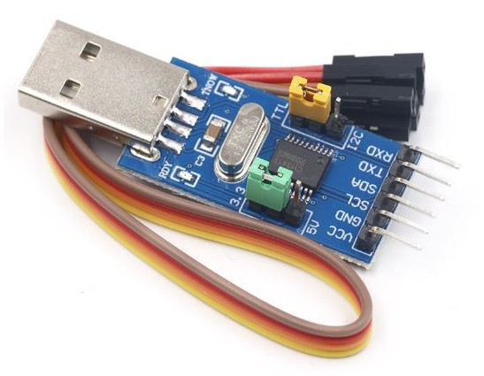

# USB Serial Devices

Connect USB serial devices (microcontrollers, sensors) to the phone through the browser using the [WebUSB API](https://developer.mozilla.org/en-US/docs/Web/API/WebUSB_API).

## Compatible hardware

WebUSB bypasses the OS driver layer, which is necessary on Android because most USB-to-serial chips (CP2102, CH340, FTDI) are not claimed by the OS and are therefore invisible to the Web Serial API.

### Native USB (CDC-ACM)

Boards with a USB controller on the main processor: Teensy 4.x / 3.x, Arduino Leonardo / Micro / Zero / MKR / Nano 33 IoT, Adafruit Feather 32u4 / M0, ESP32-S2/S3.

**Not compatible:** Arduino Uno/Nano (classic) have no USB controller.

### USB-to-UART bridge: CP2102

Found as standalone dongles and on most ESP32 dev boards (`vendorId: 0x10c4`, `productId: 0xea60 / 0xea71`).

<p align="center">
    
</p>

**Not yet supported:** CH340 / CH9102, FTDI FT232RL.

## Test page vs. integrated bridge

- **Test page** (`/test-web-usb`): standalone tool to verify hardware compatibility.
- **Integrated bridge** (requires `usb_enabled:=True`): bytes flow as ROS2 topics similar to the [ROS serial_driver](https://github.com/ros-drivers/transport_drivers/tree/main/serial_driver):
  - `usb/rx` (`std_msgs/UInt8MultiArray`) bytes from the USB device
  - `usb/tx` (`std_msgs/UInt8MultiArray`) bytes to the USB device

## Example sketch (Teensy / Arduino with native USB)

Sends a periodic heartbeat and echoes back anything received. Also bridges to UART (for CP2102 testing).

```cpp
// Wiring for CP2102 test on Teensy 4.0:
//   TX1 (pin 1) → RX of CP2102  |  RX1 (pin 0) → TX of CP2102  |  GND → GND

void setup() {
  Serial.begin(115200);
  while (!Serial);
  Serial1.begin(115200);
}

void loop() {
  static unsigned long lastSend = 0;
  if (millis() - lastSend >= 1000) {
    Serial.println("USB Serial alive");
    Serial1.println("UART alive");
    lastSend = millis();
  }

  if (Serial.available()) {
    String msg = Serial.readStringUntil('\n');
    msg.trim();
    Serial.println("Echo USB: " + msg);
  }

  if (Serial1.available()) {
    String msg = Serial1.readStringUntil('\n');
    msg.trim();
    Serial1.println("Echo UART: " + msg);
  }
}
```

## Testing

### Test page

1. Flash the sketch, open `/test-web-usb` in Chrome on Android
2. Press **Request USB device** and select your board
3. Use the **CDC Serial** section for native USB boards, **CP2102 Serial** for adapters
4. Set baud rate to 115200, press **Open**, heartbeat messages should appear
5. Type a message and press **Send**, you should receive the echo back

### Integrated bridge (ROS2)

No firmware change needed from the test above.

1. Start the server:

   ```bash
   ros2 run phone_sensors_bridge server --ros-args -p usb_enabled:=true -p usb_device_type:=cdc -p usb_baud:=115200
   ```

2. Watch incoming bytes:

   ```bash
   ros2 topic echo /usb/rx
   ```

3. Connect the board via USB OTG, open `/` in Android Chrome, tap **Connect USB device**
4. `usb/rx` should receive the heartbeat, e.g. `[85, 83, 66, ...]` = `USB Serial alive\r\n`
5. Send bytes to the device `Hello\n` = `[72, 101, 108, 108, 111, 10]`:

   ```bash
   ros2 topic pub --once /usb/tx std_msgs/msg/UInt8MultiArray "{data: [72, 101, 108, 108, 111, 10]}"
   ```

6. The board echoes `Echo USB: Hello\r\n` back on `usb/rx`
